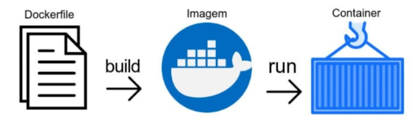

# Docker

## Introdução

Imagine que seja necessário executar um sistema que depende de diversas aplicações, todas elas consumindo recursos e armazenamento da sua máquina e rodando nas mesmas portas, rapidamente é perceptivel que isso não seria viável.
Uma alternativa seria rodar cada aplicação em uma máquina, mas imagine um sistema com várias aplicações, seria necessário muito dinheiro para investir em todos esses recursos.

Logo, podemos pensar na ideia da utilização de máquinas virtuais no entanto existe uma quantidade consideravel de recursos computacionais necessários para isso, pois cada VM simula um sistema operacional completo, logo uma máquina teria que ter a capacidade de processar todas essas virtualizações.

Por fim, a idéia mais viável seria a utilização de containers, eles permitem que seja virtualizado uma porção enxuta do sistema operacional com as dependências necessárias para a execução.

## Docker Hub

O docker hub funciona como um grande repositório de **imagens**, por meio dele podemos executar uma imagem:

```bash
docker run hello-world
```

Esse código irá verificar se a imagem 'hello-world' já existe localmente em sua máquina, caso não encontre ele fará o download dela e irá executá-la exibindo uma mensagem no terminal indicando que o docker está funcionando.

Além disso podemos baixar as imagens para a nossa máquina, então utilizando do mesmo exemplo de cima:

```bash
docker pull hello-world
```

E agora a imagem hello-world será baixada e vai estar disponivel em sua maquina.

No entanto, caso queira testar por exemplo a imagem do ubuntu caso digite ```docker run ubuntu``` nada será exibido na tela, e trataremos do porque disso mais abaixo.

## Verificando containers em execução

Para obter informações sobre containers que estão em execução você pode digitar:

```bash
docker ps
```

ou

```bash
docker container ls
```

No entanto, você irá notar que o ubuntu ainda assim não está sendo exibido, no entanto, caso você execute:

```bash
docker ps -a
```

Esse comando exibe informações sobre todos os container inclusive aqueles que não estão mais sendo executados no momento, logo, agora provavalmente você irá encontrar informações sobre o ubuntu desaparecido.


Na saída do comando serão exibidos várias informações como o ID do container, o nome da imagem que serviu como base para sua criação, a quanto tempo ele foi executado, seu status, entre outros dados.

Então por que ao executar o run ubuntu nada aconteceu?

Isso se dá porque, conforme é possivel visualizar na imagem acima, o *COMMAND* usado por padrão no momento que o container é executado é "bash", portanto, ao executar o container, ele apenas executa o bash e finaliza sua execução.

Ou seja, para que um container permaneça em execução, deve have pelo menos um processo em rodando dentro dele, caso o contrário ele será finalizado.

Então como resolver isso?

Quando executamos um container podemos passar como parâmetro um comando que será executado dentro dele, dessa forma:

```bash
docker run ubuntu [comando]
```

## Outros comandos

### Interromper execução de container

(Apenas uma informação: nos exemplos abaixo quando houver um colchete ao lado do outro, quer dizer que você pode optar por digitar um ou outro, não será preciso por exemplo, no docker stop inserir o id e o nome, você pode optar pelo o id **ou** o nome do container.)

```bash
docker stop [id_container][nome_container]
```

### Executar novamente o container que foi parado

```bash
docker start [id_container][nome_container]
```

### Executar container em modo interativo

Este comando é útil caso você deseje usar o terminal do container criado com a imagem do ubuntu citado mais acima.

Ele vai exibir o prompt no terminal com usuário root e em relação ao funcionamento do terminal interativo podemos fazer uma analogia de que é como se você estivesse de fato utilizando o terminal de outra máquina remotamente com o sistema operacional ubuntu

```bash
docker exec -it [id_container][nome_container] bash
```

### Pausar execução do container

```bash
docker pause [id_container][nome_container]
```

### Retomar (Despausar) execução do container

```bash
docker unpause [id_container][nome_container]
```

### Remover container

```bash
docker rm [id_container][nome_container]
```

### Criar novo container ubuntu e inicializá-lo em modo de execução interativo

```bash
docker run -it [nome_imagem] bash
```

### Manter container executando "detachment"

```bash
docker run -d [nome_imagem]
```

## Mapeamento de portas

Alguns containers podem (dependendo do caso) ser executados em uma porta específica em seu host, podemos visualizar a porta que ele "ouve" por meio do ```docker ps``` no entanto, supondo que apareça que seu container escuta a pora 8080, caso você digite localhost:8080 no navegador é provavel que nada aconteça, isso se dá porque o container escuta essa porta mas apenas dentro de seu proprio host, você vai precisar mapear essa porta para uma que esteja disponivel em sua máquina local.

Para isso podemos executar o comando inserindo a flag **-P**:

```bash
docker run -d -P [nome_imagem]
```

E para exibir como as portas foram mapeadas:

```bash
docker port [id_container][nome_container]
```

Ou seja, com esse último comando será possivel visualizar as portas de uso do container e as do host pelo qual será possivel acessá-las.
E dessa forma mapeamos uma porta interna do container para uma porta do nosso host.

Caso deseje um mapeamento específico substitua a flag -P por **-p**

```bash
docker run -d -p 8080:80 [nome_imagem]
```

O que o comando acima diz é que apartir da rota 8080 do nosso host será possivel acessar a porta 80 do container

## Imagens

Podemos definir de forma simplificada como a "receita" utilizada para a criação de um container.

Para listar as imagens baixadas em seu sistema digite no terminal:

```bash
docker images
```

Uma imagem é formada por um conjunto de camadas, digitando:

```bash
docker history [nome_imagem][id_imagem]
```

Será possivel visualizar as camadas que compoem aquela imagem e informações sobre cada uma.

Depois de baixada, a estrutura da imagem não pode ser alterada, visto que ela é Read-Only, no entanto, quando por exemplo executamos ela no modo terminal interativo, é visivel que podemos sim escrever nela, isso se dá pois o container nada mais é do que uma camada extra acima das camadas de imagens, que permite que possamos "escrever" nele.

Dessa forma podemos criar diversos containers apartir de uma imagem, e o custo de recursos computacionais será minimo, pois todos irão usar da mesma estrutura básica, alterando apenas a camada W/R (Write / Read).

## Criando um imagem com dockerFile



Vamos supor que você possua uma aplicação que rode por meio de um servidor criado em node, caso você não possua o node instalado no seu host, você pode executar por meio de um container.

Para isso será necessário criar uma imagem com um arquivo dockerFile, por meio dele podemos definir como será a criação da imagem.

```dockerfile
# Apartir da imagem do node na versão 14
FROM node:14

# Defina o diretório dentro de container aonde os comandos serão executados
WORKDIR /app

# Copie tudo do diretório atual do host para a pasta atual (/app) dentro do container
COPY . .

# Execute este comando dentro do diretório do container
# Nesse caso ele irá instalar as depêndencias da aplicação
RUN npm install

# E por fim o comando que será executado sempre que esse container for inicializado
ENTRYPOINT npm start
```

E por fim para "construir" a imagem por meio desse dockerFile execute:

```bash
# [nome] - "Etiqueta/apelido" que deseja dar a imagem
# . - Crie no contexto do diretório atual
docker build -t [nome] .
```

Para mais informações consulte a [documentação](https://docs.docker.com/engine/reference/builder/).

Agora para executarmos o container criado apartir da nossa imagem, podemos mapear as portas com o nosso host.

Considerando que nossa aplicação rode na porta 3000...

```bash
docker run -d -p 8081:3000 [nome_imagem]
```

Então se formos no navegador e digitarmos localhost:8081, a aplicação estará funcionando, pois mapeamos a porta 8081 do nosso host para a porta 3000 do container.
